# CS184: Computer Graphics and Imaging, Spring 2018

<!--toc:start-->
- [CS184: Computer Graphics and Imaging, Spring 2018](#cs184-computer-graphics-and-imaging-spring-2018)
  - [Project 1: Rasterizer](#project-1-rasterizer)
  - [Patrick Zhu and Tymon Thi, CS184-sopa-buena](#patrick-zhu-and-tymon-thi-cs184-sopa-buena)
  - [Overview](#overview)
  - [Section I: Rasterization](#section-i-rasterization)
    - [Part 1: Rasterizing single-color triangles](#part-1-rasterizing-single-color-triangles)
      - [Screenshots](#screenshots)
        - [`basic/test3.svg`](#basictest3svg)
        - [`basic/test4.svg`](#basictest4svg)
        - [`basic/test5.svg`](#basictest5svg)
        - [`basic/test6.svg`](#basictest6svg)
      - [Rasterizing triangles](#rasterizing-triangles)
    - [Part 2: Antialiasing triangles](#part-2-antialiasing-triangles)
      - [Why is supersampling useful?](#why-is-supersampling-useful)
      - [How we implemented supersampling](#how-we-implemented-supersampling)
    - [Part 3: Transforms](#part-3-transforms)
  - [Section II: Sampling](#section-ii-sampling)
    - [Part 4: Barycentric coordinates](#part-4-barycentric-coordinates)
      - [`svg/basic/test7.svg`](#svgbasictest7svg)
      - [What are Barycentric coordinates?](#what-are-barycentric-coordinates)
    - [Part 5: “Pixel sampling” for texture mapping](#part-5-pixel-sampling-for-texture-mapping)
      - [What is pixel sampling?](#what-is-pixel-sampling)
      - [Implementation](#implementation)
        - [Nearest sampling](#nearest-sampling)
        - [Bilinear sampling](#bilinear-sampling)
      - [Differences](#differences)
    - [Part 6: “Level sampling” with mipmaps for texture mapping](#part-6-level-sampling-with-mipmaps-for-texture-mapping)
      - [What is level sampling and how did we implement this?](#what-is-level-sampling-and-how-did-we-implement-this)
      - [Tradeoffs](#tradeoffs)
        - [Speed and memory](#speed-and-memory)
        - [Aliasing](#aliasing)
  - [Section III: Art Competition](#section-iii-art-competition)
    - [Part 7: Draw something interesting](#part-7-draw-something-interesting)
<!--toc:end-->

## Project 1: Rasterizer

## Patrick Zhu and Tymon Thi, CS184-sopa-buena

## Overview

In this assignment, we implemented a simple rasterizer that covers capabilities
including drawing single-color triangles, super-sampling, transforming
geometric objects, coloring triangles using Barycentric coordinates, and pixel
and level sampling. Essentially, we've explored the process of converting
continuous objects and images into discrete formats such as pixels in computer
screens. Each of these sampling methods have certain drawbacks and benefits in
terms of memory, speed, and anti-aliasing power. Overall, the project opened
our eyes to how sensitive the sampling process is. Very small errors/bugs would
lead to complete mistakes in the drawing of certain colors in our final
results. Additionally, we learned about the importance of being accurate about
variable types especially when converting between integers, floats, and
doubles. Even small rounding errors can lead to substantial rasterization bugs.

## Section I: Rasterization

### Part 1: Rasterizing single-color triangles

#### Screenshots

##### `basic/test3.svg`

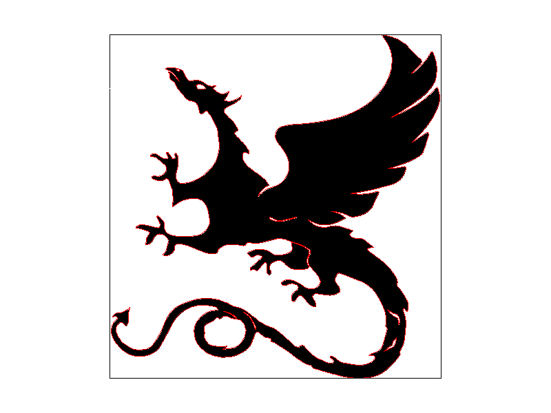

##### `basic/test4.svg`

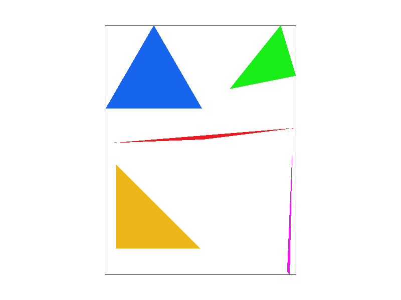

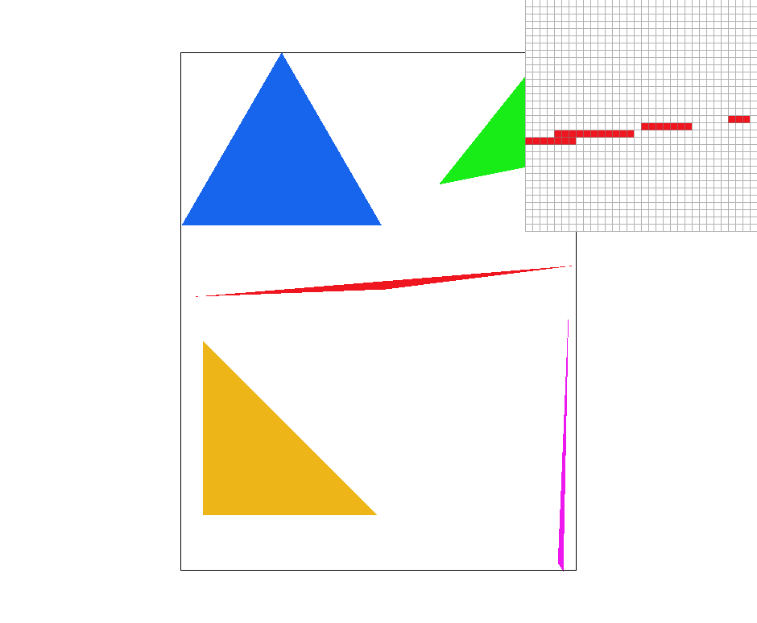

##### `basic/test5.svg`

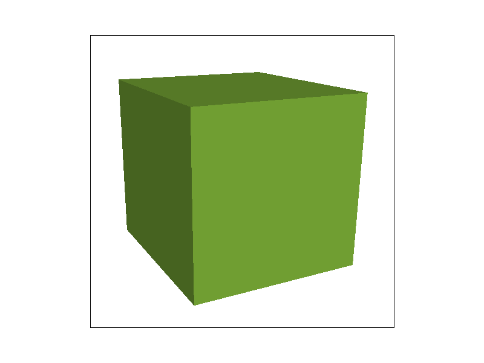

##### `basic/test6.svg`

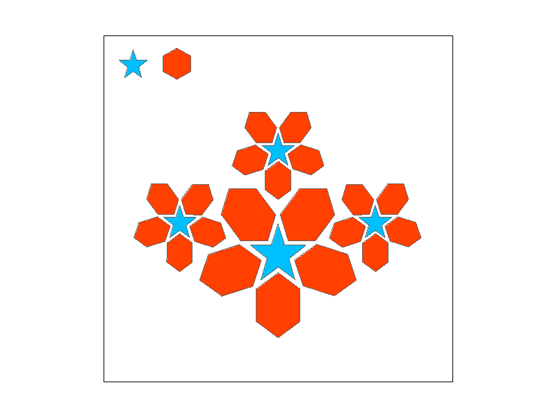

#### Rasterizing triangles

To rasterize triangles, we implemented `RasterizerImp::rasterize_triangle()` in
`rasterizer.cpp`. Following the example algorithm from
[lecture 2](https://cs184.eecs.berkeley.edu/sp23/lecture/2/digital-drawing), we
first calculate the bounding box of the triangle (the smallest rectangle that
contains the triangle), which can be found by calculating the minimum and
maximum `x` and `y` coordinates out of the 3 points of the triangle. Doing so
produces 4 values with which we can construct 2 points: `(xmin, ymin)` and
`(xmax, ymax)`. These are, respectively, the top left and bottom right corners
of the bounding box. From here we can iterate over every pixel within the
bounding box from `(xmin, ymin)` up to `(xmax, ymax)`, sampling with our
indicator function `inside()`, which returns whether the sample point is within
the triangle. If `inside()` returns true, we call `fill_pixel()` to color the
current pixel. Because we are only iterating over the pixels in the bounding
box of the triangle, our algorithm is no worse than one that checks each sample
within the bounding box of the triangle.

`inside()` is a helper function that takes in a sample point and all three
points of the triangle. The function performs 3 half plane line tests (with
helper function `line_test()`) on sample point `s` for all 3 edges (pairs of
points) of the triangle. Sample point `s = (sx, xy)` is inside the triangle if
it is on the same side of all three edges of the triangle. In other words, the
point is inside the triangle if and only if all 3 line test products have the
same sign.

### Part 2: Antialiasing triangles

#### Why is supersampling useful?

Without supersampling, we can clearly see aliasing in the form of jaggies. For
instance, not only are all edges of the triangles jagged, but the top corner of
the pink triangle in `basic/test4.svg` is disconnected from the rest of the
shape. This is because the edges of the actual triangle form such a narrow
corner that the sample points in the pixels are not registering as within the
triangle. To fix this, we need antialiasing. Supersampling is one method of
antialiasing that we can us for rasterization.

The following screenshots illustrate the difference antialiasing by supersampling
makes. Compare the top corner of the pink triangle in the image with sampling
rate of 1 to the images with supersampling.

| Sampling Rate | `basic/test4.svg` | `basic/test5` |
|---|---|---|
| 1 |  | 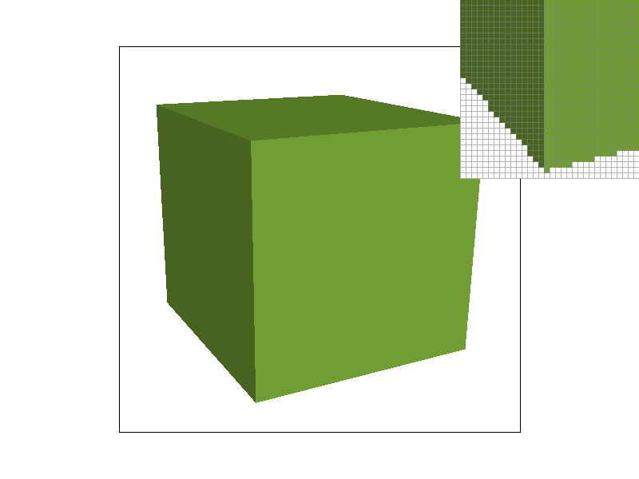 |
| 4 |  |  |
| 9 |  |  |
| 16 | 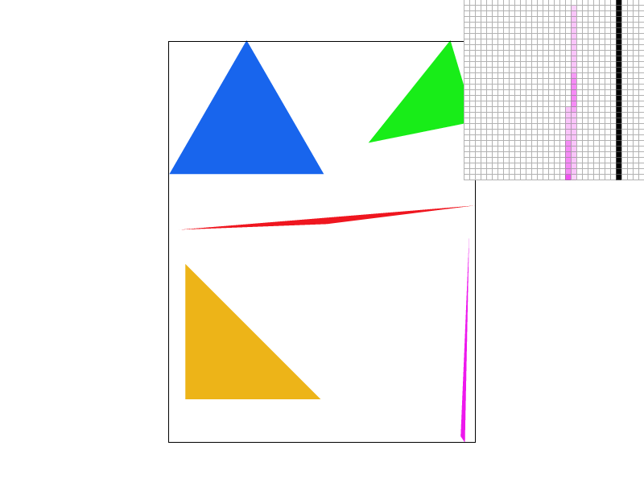 |  |

#### How we implemented supersampling

The main data structure utilized for supersampling is the `sample_buffer`, which
is a 1-d `vector<Color>` containing all samples. The size of the `sample_buffer`
is `width * height * sample_rate`. When `sample_rate = 1` (no supersampling), the
`sample_buffer` is the same size as the `framebuffer`. When `sample_rate` is changed
by `set_sample_rate()` the `sample_buffer` is accordingly scaled by the new `sample_rate`.

There are three major changes to the rasterization pipeline required to implement
supersampling. The first of which is to actually sample `sample_rate` times per
pixel when rasterizing triangles in `rasterize_triangle()`. From Task 1, we iterate
over all the pixels of the bounding box of the triangle, and sample the pixel once.
Now, for every pixel in the bounding box of the triangle, we sample `sample_rate`
times. In other words, we subdivide each pixel into a `sqrt(sample_rate) * sqrt(sample_rate)`
grid and sample each subpixel, storing each sample into the `sample_buffer`,
which is properly scaled by `sample_rate`. We add two more nested for loops and
iterate `i` and `j` from `0` to `samples_per_side`, where `samples_per_side` is
`sqrt(sample_rate)`. The offset for each subpixel is `j * samples_per_side + i`.
We index into `sample_buffer` with an additional offset for the subpixels/supersamples,
which is just the offset for each subpixel multiplied by the `width` and `height`
of the image. Then, the total index into `sample_buffer` looks like this:

```cpp
int s = j * samples_per_side + i;
sample_buffer[y * width + x + s * width * height] = color;
```

Now that we are able to sample many times per pixel and store all samples in `sample_buffer`,
the second major change is to downsample to the original image resolution. We implemented
this in `resolve_to_framebuffer()` as this function is called in the last step in
rendering the frame. We resolve our supersamples into the framebuffer by averaging=
the supersamples for one pixel into one `Color` object. Similarly to how we iterated
over subpixels in `rasterize_triangle`, we do so here for every pixel, summing
the samples into one `Color` object. Then that `Color` object is divided by `sample_rate`.
Finally, the `framebuffer` is populated with the RGB values of the `Color` object.

The third change is to ensure no supersampling/antialiasing occurs for lines and
points. We modify `fill_pixel`, which is called by `rasterize_point` and `rasterize_line`,
to fill all subpixels/supersample points with the same color. This "fills" the pixel
with one color regardless of the `sample_rate` so that it resolves to a single sampled
pixel in the framebuffer.

### Part 3: Transforms


Rotation and translation of both right and left forearms as well as in the left
leg were implemented to add movement to the cubeman, "animating" it to look
like it was dancing. For example, the left arm was translated 70 units to the
left and 20 units ups and rotated 45 degrees to create the effect that the arm
was being bent. The translation was added because the rotation itself was not
enough to account for bending of the cubeman's limbs, causing the forearm shape
to cover other parts of the cubeman's body. The colors on the figure were also
added to create a "shading" effect, using Berkeley colors.

## Section II: Sampling

### Part 4: Barycentric coordinates

#### `svg/basic/test7.svg`


#### What are Barycentric coordinates?

Barycentric coordinates are a coordinate system for triangles (or any simplex),
and they allow us to do fun things like interpolation and checking whether points
are within triangles. When used for triangles, they form a tuple of three values
that are the coefficients of values assigned to the vertices of the triangle.
A point in the triangle is defined by $(x, y) = \alpha{A} + \beta{A} + \gamma{C}$,
where $A$, $B$, and $C$ are the vertices of the triangle. Barycentric
coordinates linearly interpolate values at vertices, and the vertices can be
assigned any value, including colors. More generally, we have $V = \alpha{V_A} +
\beta{V_A} + \gamma{V_C}$. By assigning `Color` objects to each vertex, we can
interpolate between three colors when sampling points within the triangle using
barycentric coordinates, and that is exactly how we implemented `rasterize_interpolated_color_triangle()`
in `rasterizer.cpp`. $\alpha$, $\beta$, and $\gamma$ have [closed form solutions](https://cs184.eecs.berkeley.edu/public/sp23/lectures/lec-5-texture-mapping/slides/slide-28.jpg)
and can be calculated easily with each sample point, used to check if that sample
point is within the triangle, and then in the linear interpolation of the `Color`
objects assigned to each vertex of the triangle. The result is a smooth gradient/blend
of colors in the triangle.

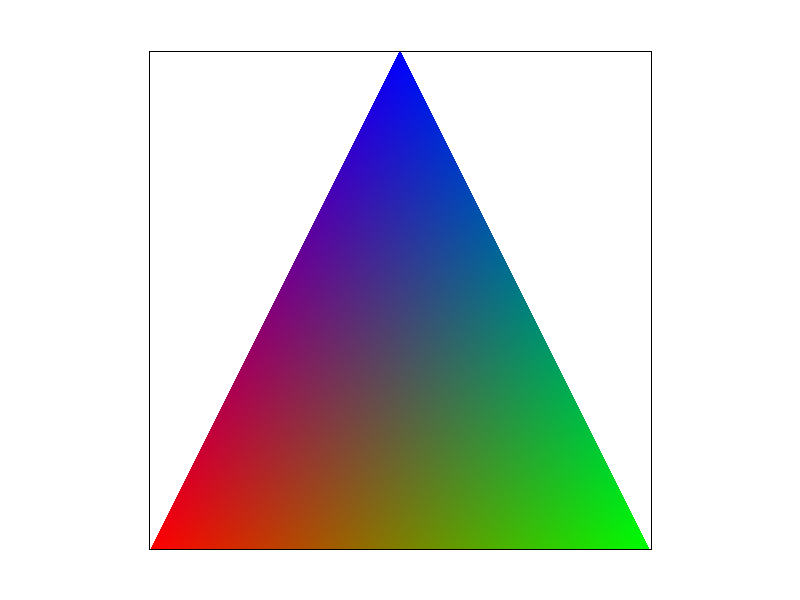

Similar to the triangle in [Lecture 5 Slide 24](https://cs184.eecs.berkeley.edu/public/sp23/lectures/lec-5-texture-mapping/slides/slide-24.jpg),
this is just a single triangle with one red, one green, and one blue vertex. The
colors are smoothly blended due to interpolation with barycentric coordinates.
We generated the triangle with `svg/task4/triangle.svg`:

```svg
<?xml version="1.0" encoding="utf-8"?>
<!-- Generator: Adobe Illustrator 16.0.4, SVG Export Plug-In . SVG Version: 6.00 Build 0)  -->
<!DOCTYPE svg PUBLIC "-//W3C//DTD SVG 1.1//EN" "http://www.w3.org/Graphics/SVG/1.1/DTD/svg11.dtd">
<svg version="1.1" id="Layer_1" xmlns="http://www.w3.org/2000/svg" xmlns:xlink="http://www.w3.org/1999/xlink" x="0px" y="0px"
    width="200.0px" height="200.0px" viewBox="0 0 200 200" enable-background="new 0 0 200 200"
    xml:space="preserve">
<colortri points="0 200 100 0 200 200" colors="1 0 0 0 0 0 1 0 0 1 0 0 "/>

</svg>
```

### Part 5: “Pixel sampling” for texture mapping

#### What is pixel sampling?

Pixel sampling is the process of identifying values (colors, texture samples) from
the vicinity of a given point. For the case of this task, we are sampling from
the texture space based on values given in screen space.

#### Implementation

We first implemented `RasterizerImp::rasterize_textured_triangle()` in
`rasterizer.cpp` to do something extremely similar to
`RasterizerImp::rasterize_interpolated_color_triangle()`, except instead of
using barycentric coordinates to linearly interpolate the colors assigned to
each vertex, it does so with the texture space $(u, v)$ coordinates of each
vertex. This results in the texture space $(u, v)$ coordinate for the current
sample point, which we then pass into `Texture::sample_nearest()` or
`Texture::sample_bilinear()` depending on the value of `psm`. Each texture
sampling function returns the `Color` of pixel in the texture mipmap level,
which is just the zeroth level for Task 5.

##### Nearest sampling

For nearest sampling, the sample point from the texture space is identified by
taking the floor of the `u` and `v` coordinates in texture space and finding
the corresponding texel in the mipmap level `level`. Flooring _both_ of these
coordinates will return the "nearest" coordinate sample (the texel in which
`$(u, v)` lies) **and** ensures we don't miss out the pixels near the origin.

##### Bilinear sampling

Bilinear sampling is implemented by taking the _four_ nearest sample
locations and then performing a total of three linear interpretations
to get the final sample value.

To implement this, the corresponding texel coordinate is found, following
similar steps to the one's described above in nearest sampling. Then, similar
to the illustration in Lecture 5, Slide 72, a "middle coordinate" is found by
rounding $(u, v)$ to get the nearest texel coordinate. This places us in the
middle of four coordinates and lets us perform bilinear interpretation between
the four sample points $(round(u) {\displaystyle \pm} .5, round(v)
{\displaystyle \pm} .5)$. We handle edge cases here by detecting when the
initially found coordinate is on the edge of the image. We sample the "middle"
of these four coordinates. Two helper `lerp`s are performed on the top two
coordinates and bottom two coordinates respectively and a final vertical `lerp`
is performed utilizing the results of the previous two `lerp`s, thus completing
the bilinear sampling.

#### Differences

| Sampling Rate <br/> (samples/pixel) | Sampling Method | Images                                                                        |
|---------------------------------|-----------------|-----------------------------------------------------------------------------------|
| 1                               | nearest         | 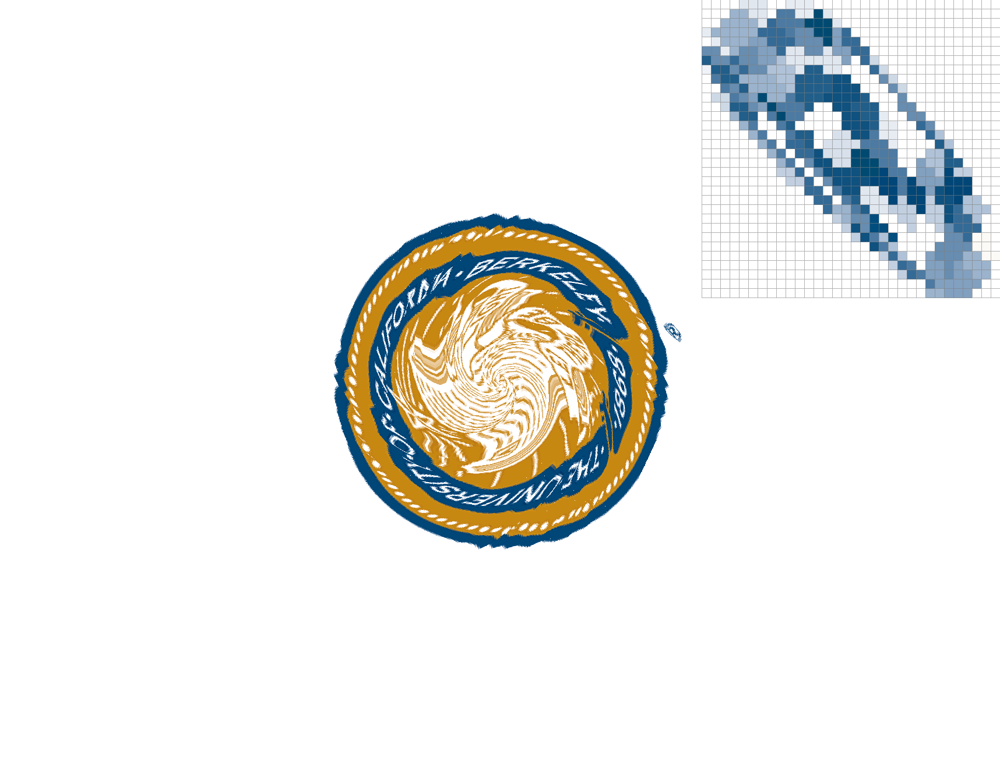     |
| 1                               | bilinear        |    |
| 16                              | nearest         |    |
| 16                              | bilinear        |  |

With 1 sample/second, there is a noticeable difference between different
sampling methods. The bilinear, 1 sample/second image has fewer jaggies and the
shape is almost discernible. For the results obtained from sampling with 16
samples/second, the image sampled with nearest the gap in quality is less
noticeable given that super sampling occurs, but the image obtained with
bilinear sampling is has far less aliasing.

The explanation behind this is simply that interpolating more samples will
produce a higher quality image rather than just relying on one, "nearest"
sample. This is more evident with smaller, higher frequency parts of the image,
hence why we chose the small (R) in the Berkeley seal. Going further, the
reasoning behind this is when there are parts of the image that are rapidly
changing (such as at the edge of an object), taking one, nearest sample
typically not capture edge details as well as if you take higher samples and/or
interpolate, which is why we can expect the highest quality image with bilinear
sampling at 16 samples/second.

### Part 6: “Level sampling” with mipmaps for texture mapping

#### What is level sampling and how did we implement this?

Mipmaps are used as an optimization and, conceptually, are a collection of
pre-computed, filtered versions of the texture, with each level representing a
select granularity of filtering. Specifically, the 0th level mipmap is the full
resolution image/texture. As the level increases, the resolution of the image
is decreased by downsampling by a factor of 2 in each dimension. By only
storing an extra third of memory for each image/texture, mipmaps help antialias
when texture mapping by using level sampling. Level sampling involves
calculating the appropriate mipmap level to use based on distance. The greater
the distance, the greater the mipmap level should be so that when sampling the
texture, the smaller mipmap image won't be undersampled when rasterized to a
small part of the screen.

We implemented level sampling by first making sure to call `Texture::sample()`
in `RasterizerImp::rasterize_textured_triangle()` and passing in a
`SampleParams` struct containing the $(u, v)$ barycentric coordinates of $(x,
y)$, $(x + 1, y)$, and $(x, y + 1)$. Then, `sample()` handles the level sample
method in `psm` as follows. When `lsm == L_ZERO`, we sample with `level = 0`.
When `psm == L_NEAREST`, we calculate the level with `get_level()` and round it
to get the nearest level. And when `lsm == L_LINEAR`, we calculate the level
as a continuous value, `floor` it to get the adjacent level below, and `ceil`
it to get the level above. With these two levels, we sample the texture twice
and linear interpolate between the two colors for the final color of the sample.

#### Tradeoffs

##### Speed and memory

With level sampling or mipmapping, we have generally improved speed and memory
usage because the full quality of a texture need not be fully loaded to render
every object on a scene. Objects in the "background" don't need the full
quality of the texture because they require less detail to be rendered without
too much aliasing and so "smaller" versions of a texture for distant objects
minimizes the need to load a full-size version of a texture. On the other hand
pixel sampling requires loading a full texel each time. Additionally, because
of  the design of mipmaps, there's less texture data that needs to be store.
Increasing the number of samples will increases the amount of computation
quadratically and this is reflected in both speed and memory.

##### Aliasing

The calculation of the "distance" of two points in texture space and the
corresponding mipmap level in level sampling reduces aliasing by smoothing out
jaggies from the image. Selectively choosing, say, a lower-frequency versus
higher-frequency mipmap level will remove aliasing/smooth out our jaggies. Of
course, increasing the number of samples will generally decrease the amount of
aliasing, but at the cost of speed and memory as mentioned above.

| Combination                 | Image                                                              |
|-----------------------------|--------------------------------------------------------------------|
| `L_ZERO` AND `P_NEAREST`    | 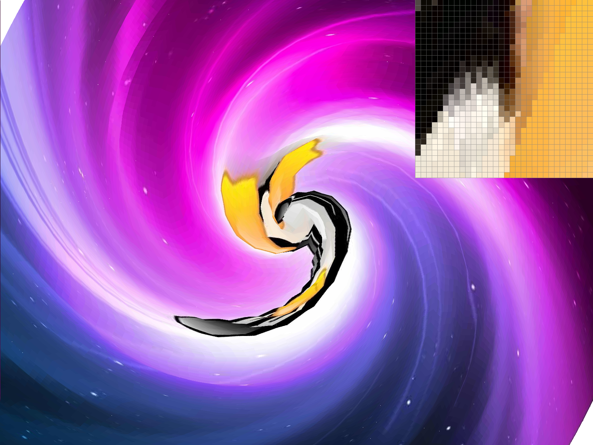       |
| `L_ZERO` AND `P_LINEAR`     |          |
| `L_NEAREST` AND `P_NEAREST` | 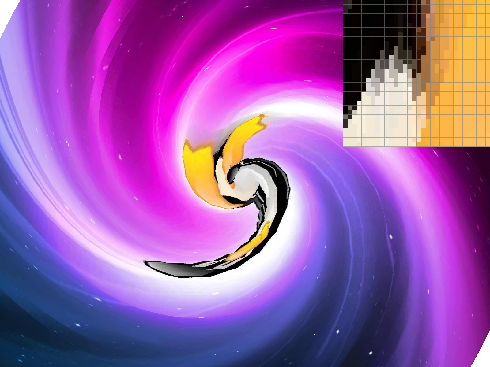 |
| `L_NEAREST` AND `P_LINEAR`  |    |

## Section III: Art Competition

If you are not participating in the optional art competition, don't worry about
this section!

### Part 7: Draw something interesting
